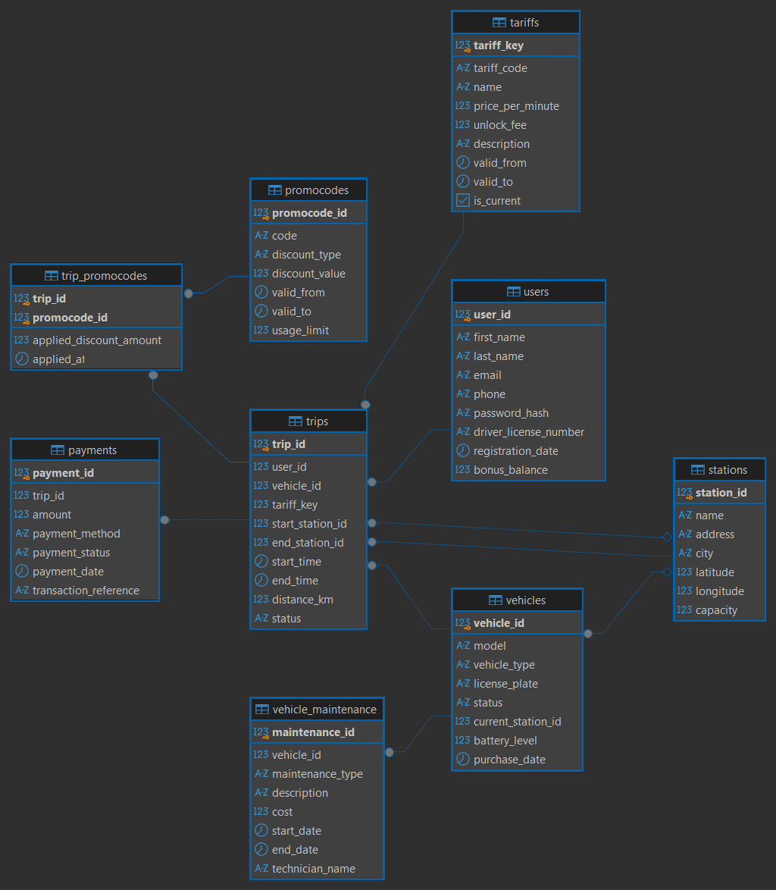

# Каршеринг 🛴 — pet-проект по проектированию БД

> от идеи до полноценной реляционной базы данных в PostgreSQL — концептуальная модель → логическая модель → физическая модель → DDL → данные → аналитика → индексы, представления, процедуры и транзакции.

---

##  Содержание

- [О проекте](#-о-проекте)
- [Физическая модель](#-физическая-модель)
- [Сценарии использования](#-сценарии-использования)
- [Где это можно использовать](#-где-это-можно-использовать)

---

##  О проекте

**Предметная область:** сервис каршеринга — аренда самокатов, велосипедов и автомобилей. Пользователи регистрируются в приложении, берут транспорт на станциях, совершают поездки по одному из версионируемых тарифов, оплачивают их и могут применять промокоды. Транспорт периодически проходит техническое обслуживание.

###  Состав схемы — 9 сущностей

| Таблица | Назначение |
|---|---|
|  `users` | Пользователи сервиса |
|  `stations` | Станции парковки транспорта |
|  `vehicles` | Транспортные средства (самокаты, велосипеды, авто) |
|  `tariffs` | Тарифы — **версионируемая таблица (SCD2)** |
|  `trips` | Поездки — центральная факт-таблица |
|  `payments` | Платежи по поездкам |
|  `promocodes` | Промокоды на скидку |
|  `trip_promocodes` | Связка поездок и промокодов (M:M) |
|  `vehicle_maintenance` | Журнал технического обслуживания |

###  Нормализация

Схема приведена к **3НФ**:
- **1НФ** — устранены повторяющиеся группы (например, история обслуживания вынесена в отдельную таблицу, а не хранится списком в одном поле)
- **2НФ** — проверены частичные зависимости от составного ключа (`trip_promocodes`)
- **3НФ** — устранены транзитивные зависимости (цена тарифа не хранится напрямую в `trips`, а достаётся через `tariff_key`)

###  Версионирование — SCD2

Таблица `tariffs` реализует **SCD2**: при изменении цены старая версия не перезаписывается, а закрывается (`valid_to`, `is_current = false`), и добавляется новая строка.

> 💡 **Почему именно SCD2?** Поездка навсегда должна ссылаться на ту цену, что действовала в момент её совершения — иначе финансовая история искажается задним числом. SCD1 стирает историю полностью, SCD3 хранит только одну предыдущую версию — тарифы же могут меняться многократно за время жизни проекта.

###  Диаграммы предметной области

| Концептуальная модель | Логическая модель |
|---|---|
| [`docs/conceptual-model.png`](docs/conceptual-model.png) | [`docs/logical-model.png`](docs/logical-model.png) |

---

##  Физическая модель

Диаграмма построена по реальной структуре базы данных (сгенерирована в DBeaver из уже развёрнутой схемы в PostgreSQL) и показывает все 9 таблиц с полным набором столбцов, их типами данных и связями (первичные и внешние ключи).

📄 Полное текстовое описание всех атрибутов, типов PostgreSQL и ограничений — в [`docs/physical-model.md`](docs/physical-model.md).

### Ключевые архитектурные решения

-  Суррогатные первичные ключи (`serial`) везде, кроме `trip_promocodes` — там **составной ключ** `(trip_id, promocode_id)`, так как уникальность строки определяется именно парой значений
-  `ON DELETE RESTRICT` — там, где удаление родителя угрожает финансовой истории (пользователь, транспорт, тариф в поездках)
-  `ON DELETE CASCADE` — там, где дочерние записи бессмысленны без родителя (платежи, обслуживание, связка промокодов)
-  `ON DELETE SET NULL` — на связи `vehicles → stations`: удаление станции не должно уничтожать запись о транспорте, он просто «теряет» текущую локацию
-  `CHECK`-ограничения на уровне БД для всех бизнес-правил (неотрицательные суммы, корректные координаты, допустимые статусы)

---

##  Сценарии использования

###  Скрипты

Все SQL-скрипты — в папке `scripts/`:

| Файл | Содержимое |
|---|---|
| `01_ddl.sql` | Создание всех 9 таблиц схемы с ограничениями |
| `02_dml.sql` | Заполнение таблиц данными |
| `03_queries.sql` | 18 аналитических запросов с описаниями |
| `04_extra.sql` | Индексы, представления, процедуры, транзакции |

### ▶️ Порядок запуска

>1️⃣ Создать базу данных PostgreSQL (например, `carsharing_db`)
>2️⃣ Выполнить `scripts/01_ddl.sql` → создаёт все таблицы
>3️⃣ Выполнить `scripts/02_dml.sql` → заполняет тестовыми данными
>4️⃣ Выполнить `scripts/03_queries.sql` → запускать запросы по одному
>5️⃣ Выполнить `scripts/04_extra.sql` → индексы, представления, процедуры

> ⚠️ **Важно про порядок в `01_ddl.sql`:** таблицы создаются с учётом внешних ключей — сначала независимые `stations`/`users`, затем зависимые от них.
>
> ⚠️ **Важно про транзакции в `04_extra.sql`:** блоки `BEGIN ... COMMIT` нужно выполнять **целиком, одним пакетом** (в DBeaver — выделить весь блок и нажать `Alt+X`), а не построчно — иначе `COMMIT` не найдёт активной транзакции.

###  Ожидаемые результаты

| Шаг | Результат |
|---|---|
| 1–2 | 9 пустых таблиц с применёнными ограничениями |
| 3 | 15 станций · 15 пользователей · 15 ТС · 15 промокодов · 30 версий тарифов · 40+ поездок · 40+ платежей · 30+ связок промокодов · 15 записей обслуживания |
| 4 | Каждый запрос возвращает набор строк согласно описанию в комментарии над ним |
| 5 | 5 индексов · 3 представления (`v_trip_details`, `v_current_tariffs`, `v_user_spending`) · процедура `add_station` · применённые транзакции |

---

## 💡 Где это можно использовать

-  backend-приложение каршеринга
-  Тренировка аналитических SQL-запросов на реалистичном наборе связанных таблиц
-  Референс-реализация **SCD2**-версионирования — применима не только к каршерингу, но и к любой области с изменяющимися во времени характеристиками (подписки, прайс-листы, условия услуг)

---

